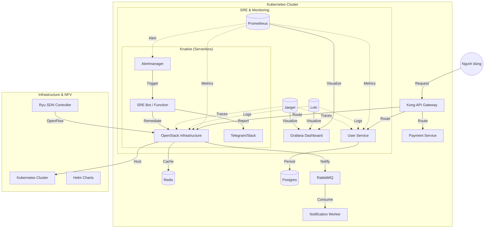

# SRE-Focused Cloud Native Microservice shared (`cloud_sre`)

Dự án mô phỏng một hệ thống Cloud-Native thực tế, tập trung vào các nguyên tắc **SRE (Site Reliability Engineering)**: Độ tin cậy (Reliability), Khả năng co giãn (Scalability), Tự phục hồi (Self-healing), và Tối ưu hóa vận hành thông qua Tự động hóa (Automation).

## 🌍 Luồng hoạt động hệ thống (System Flow)



## 📶 Cloud-Native 5G Core & SDN/NFV
Dự án tích hợp mô phỏng mạng 5G Core trên nền tảng NFV:
- **Hạ tầng NFV**: Sử dụng OpenStack để ảo hóa tài nguyên phần cứng.
- **SDN Controller**: Ryu Controller quản lý định tuyến lưu lượng 5G qua giao thức OpenFlow.
- **5G Core Functions**: AMF, SMF, UPF chạy dưới dạng container trên Kubernetes.
- **Traffic Simulation**: UERANSIM giả lập thiết bị đầu cuối (UE) và trạm phát sóng (gNodeB) để kiểm tra hiệu năng mạng.

## Kiến trúc hệ thống (Architecture)
- **API Gateway**: Kong (với Rate Limiting & Ingress Controller)
- **Microservices**: 
  - **User Service**: Quản lý người dùng, kết nối **Postgres** thật.
  - **Order Service**: Xử lý đơn hàng, tích hợp **Redis Cache** để tối ưu hiệu năng.
  - **Payment Service**: Xử lý thanh toán, có chế độ "Chaos Mode" giả lập lỗi.
  - **Notification Worker**: Consumer RabbitMQ gửi thông báo.
- **Middleware**: 
  - **RabbitMQ**: Message Broker cho giao tiếp bất đồng bộ.
  - **Postgres**: Cơ sở dữ liệu quan hệ (Persistent Store).
  - **Redis**: In-memory cache cho tốc độ phản hồi cực nhanh.
- **Observability**: Prometheus, Grafana, Loki, Jaeger.

## 🚀 Các giá trị SRE cốt lõi trong dự án

### 1. Tự phục hồi (Self-healing) & Serverless
Thay vì chạy worker 24/7 tốn tài nguyên, dự án sử dụng **Knative** để triển khai `sre-bot`. Khi có lỗi hoặc cảnh báo từ Prometheus, function này sẽ được kích hoạt để thực hiện các hành động sửa lỗi tự động (như dọn cache, restart pod).

### 2. Quản lý SLO/SLI (Service Level Objectives)
Hệ thống được thiết kế để đo lường độ trễ (Latency) và tỷ lệ lỗi (Error Rate) theo thời gian thực. Các file cấu hình SLO (`sre/slo/*.yaml`) giúp định nghĩa mức độ tin cậy mong muốn của người dùng.

### 3. Tối ưu tài nguyên (FinOps/Scalability)
Mọi service đều được cấu hình **Resource Limits** và **Probes** nghiêm ngặt để đảm bảo không làm quá tải Cluster. Sự kết hợp giữa **HPA** (K8s) và **Scale-to-Zero** (Knative) giúp hệ thống chỉ sử dụng đúng lượng tài nguyên cần thiết.

---

## 🏗️ Hướng dẫn vận hành nhanh (Quick Start)

### 1. Triển khai bằng Kubernetes Manifests (Ưu tiên)
Đây là cách triển khai trực tiếp, giúp bạn kiểm soát hoàn toàn từng tài nguyên:
```bash
# Triển khai toàn bộ cấu hình (ConfigMap, Services, Deployments)
kubectl apply -f infrastructure/k8s/

# Triển khai Knative Service cho SRE Automation
kubectl apply -f infrastructure/k8s/knative-service.yaml

# Kiểm tra trạng thái các Pod và Knative Service
kubectl get pods
kubectl get ksvc
```

### 2. Triển khai bằng Helm (Nếu muốn quản lý tập trung)
```bash
helm install cloud-sre infrastructure/helm/
```

### 3. Thử nghiệm SRE (Load & Chaos Test)
```bash
# Chạy script tạo tải để kích hoạt HPA
bash experiments/load-test/load_test.sh http://localhost:80/orders 60
```

### 5. Tiện ích Automation (Makefile)
Để thao tác nhanh hơn, bạn có thể dùng Makefile:
```bash
make deploy-k8s      # Triển khai toàn bộ
make deploy-knative  # Triển khai Serverless
make load-test       # Chạy test nhanh
```

## 📊 Observability & SRE Fundamentals (Intern Focus)

*   **Golden Signals Dashboard**: Đã cấu hình sẵn tại `observability/grafana/golden-signals.json`. Tập trung vào: Latency, Traffic, Errors, Saturation.
*   **CI/CD Pipeline**: Tự động hóa qua GitHub Actions tại `.github/workflows/ci-cd.yaml`.
*   **GitOps (ArgoCD)**: Cấu hình đồng bộ hóa hạ tầng tự động tại `infrastructure/gitops/argocd-app.yaml`.
*   **Incident Management**: Mẫu báo cáo sự cố chuyên nghiệp tại `docs/incidents/template-post-mortem.md`.
